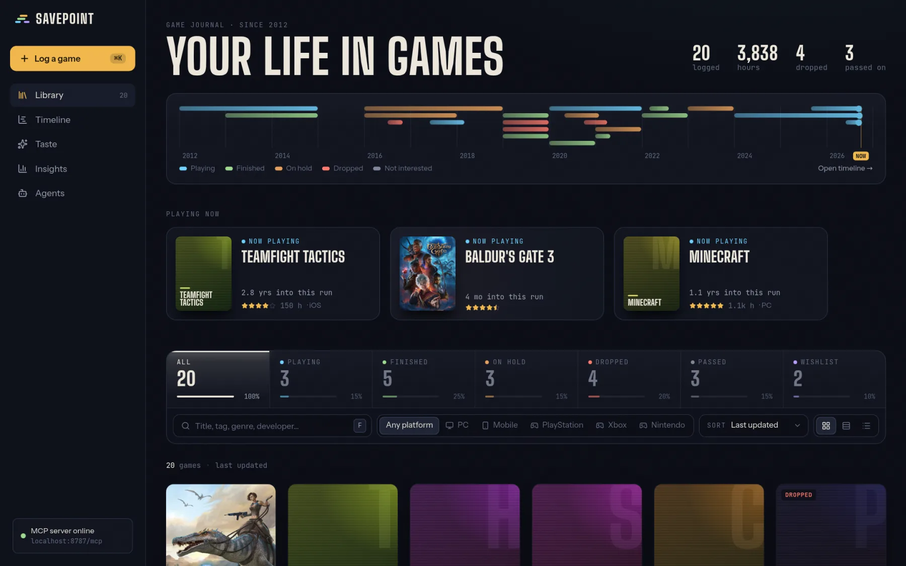
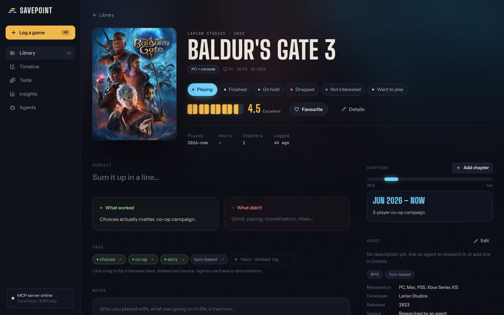
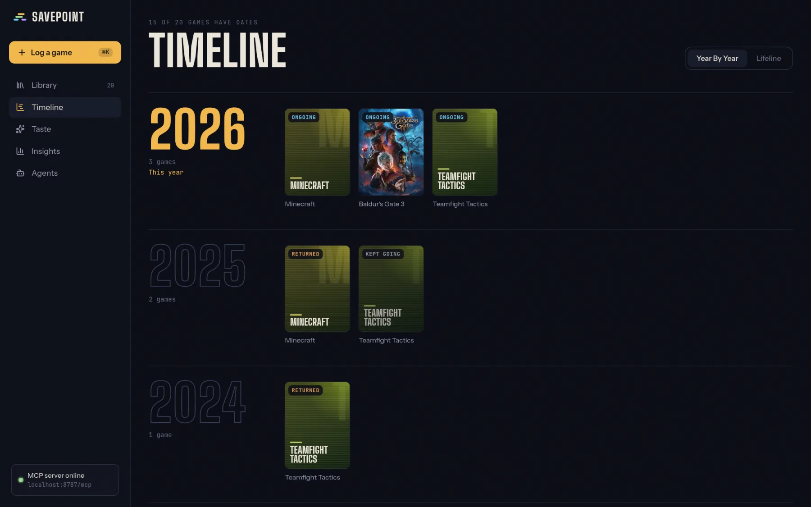
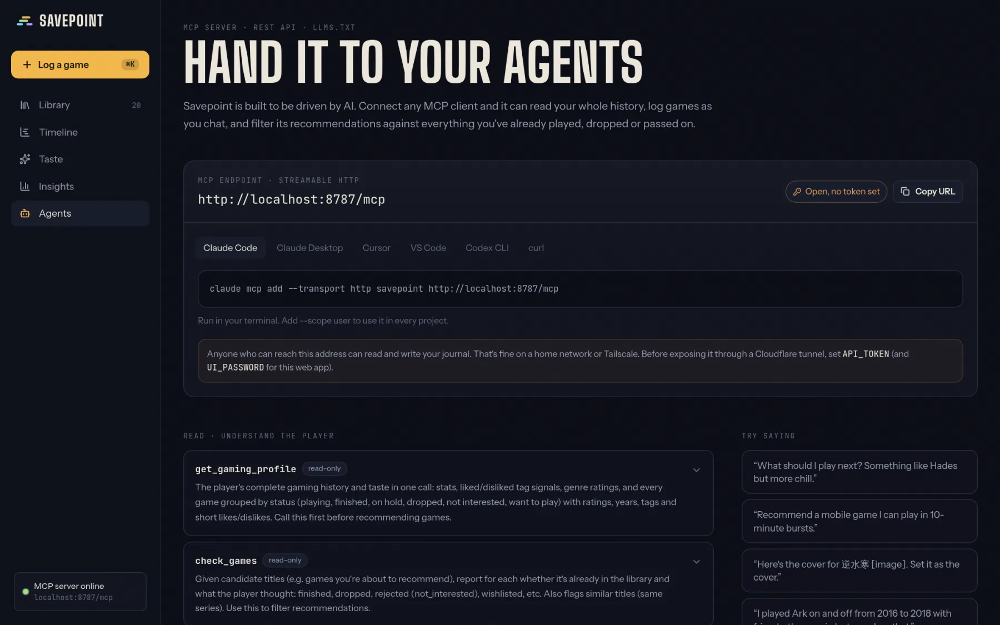

<p align="center"></p>

<h1 align="center">Savepoint</h1>

<p align="center">
A self-hosted game journal that your AI agents can read and write.<br>
Log what you played, when, how it went, what you dropped and what you passed on,<br>
so any agent can recommend your next game without suggesting one you already hated.
</p>

<p align="center">
Agent skill · MCP server · REST API · web UI · one container · one SQLite file
</p>



## Why

Trakt and Simkl do this for film and TV. For games there's nothing simple you can self-host and hand to an agent. Backloggd and HowLongToBeat have no public API, and Ryot needs Postgres and tracks far more than games.

Savepoint is built for one person and their agents:

- **A complete history, including the bad parts.** Finished, dropped, on hold, "looked at it and passed". The games you rejected matter as much as the ones you loved, because they stop an agent recommending them again.
- **Play that happens in stretches.** Minecraft in 2012, again in 2017, again now. Each stretch is its own chapter with dates, platform, hours and a note, and they show up on a lifeline across your years.
- **Why you liked it.** Half-step star ratings, a one-line verdict, what worked, what didn't, and tags marked liked or disliked (`+story`, `-grind`), so agents can spot patterns.
- **Where you play.** Every game gets a platform bucket (PC only, mobile only, PC + console, everywhere…), and you say which platforms you actually use, so recommendations stay on hardware you own.
- **Any game, not just what's in a database.** Details and cover art come from Steam and the App Store (including the China store) with no account or key. For anything else, like console exclusives or delisted games, agents research it and fill it in.

Recommendations happen in your agent's chat, not in the app. Savepoint just gives the agent the full picture.

## Screenshots

| Game page | Timeline |
| --- | --- |
|  |  |

| Agents page |
| --- |
|  |

## Run it

```bash
docker run -d --name savepoint -p 8787:8787 \
  -v /path/to/appdata/savepoint:/data \
  ghcr.io/josephcy95/savepoint:latest
```

Open `http://<host>:8787`. The image is multi-arch (amd64, arm64).

**Docker Compose:** grab [`docker-compose.yml`](docker-compose.yml) and run `docker compose up -d`.

**Unraid:** copy [`deploy/unraid-savepoint.xml`](deploy/unraid-savepoint.xml) to `/boot/config/plugins/dockerMan/templates-user/`, then *Docker → Add Container → Template → savepoint*.

Everything lives in `/data`: `savepoint.db` and an uploaded `covers/` folder. Back up that folder, or use *Agents → Backup → Export JSON*.

### Configuration

All optional.

| Variable | What it does |
| --- | --- |
| `API_TOKEN` | Require `Authorization: Bearer <token>` for `/api` and `/mcp`. Set this before exposing it through a Cloudflare tunnel or similar. |
| `UI_PASSWORD` | Password screen for the web UI (90-day cookie). The API token also works as a password. |
| `PUBLIC_URL` | External URL used in the docs and copy-paste snippets. Auto-detected otherwise. |
| `IGDB_CLIENT_ID` / `IGDB_CLIENT_SECRET` | Optional extra lookup source for console-only games. Needs a [Twitch developer app](https://api-docs.igdb.com/#account-creation). Steam and App Store lookup work without it. |
| `PORT`, `DATA_DIR` | Default `8787` and `/data`. |

With nothing set, anyone who can reach the port can read and write the journal. That's fine on a home network or Tailscale.

## Connect an agent

There are two ways in. Pick per agent.

| | Skill | MCP |
| --- | --- | --- |
| Best for | A general assistant that mostly does other things (Hermes, Claude Code) | A dedicated game agent, or apps without a terminal (Claude Desktop, Cursor) |
| Context cost | ~80 tokens until games come up, then ~1.1k for that conversation | ~3.8k tokens on every turn |
| How it talks to Savepoint | `curl` against the REST API | Typed MCP tools, prompts and resources |
| Needs | A terminal tool | An MCP client |

The **Agents** page in the app shows both, with copy-paste setup for each client. Open it from the address your agent will use (LAN IP or Tailscale name), because the links it hands out use that address. Or set `PUBLIC_URL`.

### Skill

Savepoint serves an [agentskills.io](https://agentskills.io)-format skill at `/skill/SKILL.md`, filled in with this server's address. It covers reading the profile, checking candidates, and logging games and play sessions with curl. The file is public and never contains your token.

```bash
# Hermes
hermes skills install http://<host>:8787/skill/SKILL.md
# or just tell it: "Install the Savepoint skill from http://<host>:8787/skill/SKILL.md"

# Claude Code
mkdir -p ~/.claude/skills/savepoint && curl -so ~/.claude/skills/savepoint/SKILL.md http://<host>:8787/skill/SKILL.md
```

If you set `API_TOKEN`, give the agent a `SAVEPOINT_TOKEN` env var (for Hermes, add it to `~/.hermes/.env`).

### MCP

Streamable HTTP at `http://<host>:8787/mcp`.

```bash
# Claude Code
claude mcp add --transport http savepoint http://<host>:8787/mcp --header "Authorization: Bearer $TOKEN"
```

```yaml
# Hermes: ~/.hermes/config.yaml, then /reload-mcp
mcp_servers:
  savepoint:
    url: "http://<host>:8787/mcp"
    headers:
      Authorization: "Bearer ${SAVEPOINT_TOKEN}"
    lazy: true
    tools:
      include: [get_gaming_profile, check_games, search_games, get_game, add_game, update_game, log_play_period]
```

Agents with neither can read `/llms.txt`, `/api/openapi.json`, or just `GET /api/profile`.

### Try it

Then ask things like:

- "What should I play next? Something co-op I can play on PC or my phone."
- "I just finished Hades, log it. 5 stars, loved the combat loop, got tired of the last biome."
- "Interview me about games I played as a kid and backfill them."
- "Would I like Path of Exile 2?"

### Tools

| Area | Tools |
| --- | --- |
| Read | `get_gaming_profile`, `search_games`, `get_game`, `check_games`, `get_stats`, `get_recent_activity` |
| Write | `add_game`, `bulk_add_games`, `update_game`, `delete_game`, `set_cover` |
| Chapters | `log_play_period`, `update_play_period`, `delete_play_period` |
| Taste | `get_player_settings`, `update_player_settings`, `list_tags`, `manage_tag` |
| Metadata | `lookup_game`, `fill_from_lookup` (Steam, App Store, and IGDB if configured) |

Prompts: `recommend_games`, `backfill_history`, `review_game`. Resources: `savepoint://profile`, `savepoint://guide`.

Both the skill and the MCP server tell agents how to behave. They read the profile before recommending, run every candidate through `check_games`, never suggest a `not_interested` game, log rough dates without nagging for exact ones, and research metadata themselves for games no store has.

## Data model

- **Game.** Title is the only required field. Alt titles (e.g. the original Chinese name), status, 0.5–5★ rating, favourite, verdict, liked, disliked, notes, plus metadata: release platforms, genres, developer, release year, description, cover, links and where the details came from (Steam, App Store, IGDB, an agent or you).
- **Status.** `playing` · `finished` · `on_hold` · `dropped` · `not_interested` · `want_to_play`.
- **Chapters.** Any number per game. Start and end year (month optional) or ongoing, platform, rough hours, how you played, a note and an optional rating for that stretch.
- **Tags.** Per-game sentiment: `+story` (liked), `-grind` (disliked), `roguelike` (neutral). One shared vocabulary you can rename and merge.
- **Platforms.** Release platforms are grouped into families (PC, mobile, PlayStation, Xbox, Nintendo) and a bucket such as PC only or PC + mobile. Where you actually played comes from your chapters.
- **Covers.** Upload your own, paste a link, or have an agent send one with `set_cover`. Games without one get a generated title card.
- **Activity.** Every change is logged with who made it: you (web UI), an agent (MCP) or the REST API.

Games can be referenced by id or title anywhere. Titles match fuzzily and include alt titles, so "baldurs gate 3", "Justice Online" or "逆水寒" all find the same games.

## Develop

Requires Node 24+. The server runs TypeScript directly with no build step.

```bash
npm install
npm run dev                          # API on :8787, Vite on :5173
npm test                             # smoke tests
npm run typecheck
DATA_DIR=./demo-data npm run seed    # sample history to look at
```

Stack: Hono, `node:sqlite`, the MCP TypeScript SDK and zod on the server; React 19, Vite, Tailwind v4 and TanStack Query for the UI.

Pushing to `main` builds and publishes `ghcr.io/josephcy95/savepoint:latest`. Tagging `v1.2.3` also publishes `1.2.3` and `1.2`.

## License

[MIT](LICENSE)
